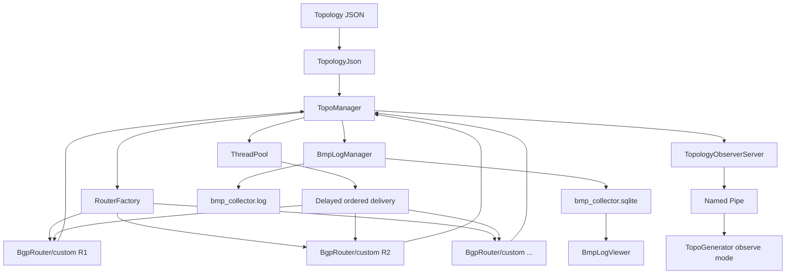
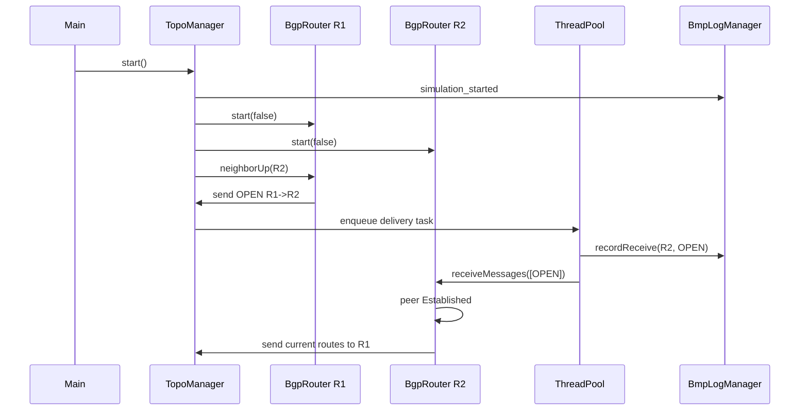
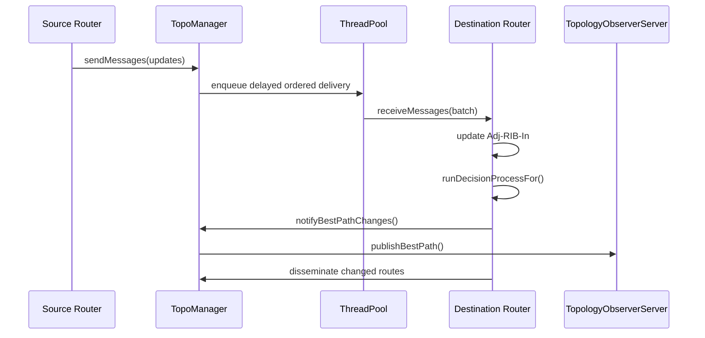

# BgpSimulator 设计文档

本文档用于从源码角度理解 `TopoSimulator` / `BgpSimulator` 的整体设计、线程模型、主要类职责、消息流、路由决策、日志系统和构建组织。文档描述的是当前代码实现，而不是完整 BGP 协议规范。

## 1. 项目定位

`TopoSimulator` 是一个纯 C++ 的 BGP 拓扑仿真器。它把拓扑 JSON 加载成一组由 `RouterFactory` 创建的路由器对象，默认使用 `BgpRouter`，也可以在每次实验启动时选择自定义路由器子类。`TopoManager` 统一调度消息投递、链路延迟、MRAI 定时和节点/链路状态变化。仿真过程中产生的 BMP 风格日志会同时写入 JSONL 文件和 SQLite，内置 ImGui 查看器可用于实时查看和历史查询。

项目主要目标：

- 用较小的代码模型表达 BGP 路由传播、撤销、选路、RR 反射、MRAI 和链路/节点故障。
- 保持核心仿真逻辑在 C++ 内部，不依赖 Python 运行时。
- 用异步任务模拟链路延迟和定时器，同时保留确定性较强的有序投递语义。
- 用 SQLite 为 BMP 日志查询和 UI 分析提供结构化数据。
- 用 named pipe 向外部拓扑观察器推送实时最优路径变化。

当前项目是 Windows/MSVC 专用工程，CMake 会显式拒绝非 Windows 或非 MSVC 环境。

## 2. 源码组织

```text
TopoSimulator/
  CMakeLists.txt
  vcpkg.json
  build.ps1
  README.md
  DESIGN.md
  include/toposim/
    BgpTypes.hpp
    BgpRouter.hpp
    RouterFactory.hpp
    TopoManager.hpp
    ThreadPool.hpp
    BmpLogManager.hpp
    BmpLogViewer.hpp
    TopologyJson.hpp
    TopologyObserverServer.hpp
  src/
    BgpTypes.cpp
    BgpRouter.cpp
    RouterFactory.cpp
    TopoManager.cpp
    ThreadPool.cpp
    BmpLogManager.cpp
    BmpLogViewer.cpp
    BmpLogViewerMain.cpp
    TopologyJson.cpp
    TopologyObserverServer.cpp
    main.cpp
  tests/
    core_tests.cpp
  topo/
    sample_topology.json
  config/
    sample_topology.json
    testtopology.json
```

CMake 产物分为几个层次：

- `toposim` 静态库：核心仿真逻辑，包括 `BgpRouter`、`RouterFactory`、`TopoManager`、`ThreadPool`、`BmpLogManager`。
- `toposim_io` 静态库：JSON 读写和拓扑观察 named pipe，依赖 `toposim`。
- `TopoSimulator.exe`：命令行仿真入口，同时链接 ImGui BMP 查看器。
- `BmpLogViewer.exe`：独立 BMP SQLite 日志查看器。
- `TopoSimulatorTests.exe`：核心单元测试。

依赖项：

- C++20
- `nlohmann_json`
- `spdlog`
- `sqlite3`
- `imgui`
- Win32 / D3D11 / DXGI

## 3. 高层架构



核心分工：

- `BgpRouter`：单台路由器的 BGP 状态机、RIB、选路、进出口策略、MRAI 队列。
- `RouterFactory`：维护可用路由器类注册表，按 `simulation.router_class` 创建本次实验使用的路由器对象。
- `TopoManager`：拓扑级生命周期、链路和节点状态、消息投递、线程池、收敛检测、BMP 日志目录。
- `ThreadPool`：执行延迟投递和定时任务。
- `BmpLogManager`：收集 BMP 风格事件，维护实时内存窗口，异步写 JSONL 和 SQLite。
- `BmpLogViewer`：ImGui/D3D11 日志查看 UI，可实时查看或独立打开 SQLite。
- `TopologyObserverServer`：固定 named pipe 服务端，向外部观察器推送拓扑文件路径和最优路径变化。
- `main.cpp`：CLI、命令解析、启动顺序、等待收敛。

## 4. 核心数据模型

核心类型定义在 `include/toposim/BgpTypes.hpp`。

### 4.1 BGP 消息

- `BgpMessageType`
  - `Open`
  - `Update`
  - `Notification`
- `BgpMessage`
  - `from` / `to`：逻辑路由器 ID，例如 `R1`。
  - `sequence`：由 `TopoManager` 全局递增分配。
  - `open` / `update` / `notification`：对应 payload。

`BgpUpdatePayload` 包含：

- `withdrawn_routes`：撤销前缀列表。
- `nlri`：宣告前缀列表。
- `path_attributes`：路径属性。

当前代码允许一个 `BgpMessage` 同时携带 `withdrawn_routes` 和 `nlri`，但路由器内部生成消息时通常每个 `PendingUpdate` 形成一个 `BgpMessage`。MRAI 到期时，多个 `BgpMessage` 会被打包进同一次 `TopoManager::sendMessages()` 投递批次；接收端会批量接收并逐条处理，最后统一运行一次决策流程。

### 4.2 路径属性

`PathAttributes` 当前包含：

- `origin`
- `as_path`
- `next_hop`
- `local_pref`
- `med`
- `originator_id`
- `cluster_list`
- `communities`

这是仿真所需的简化属性集合，不是完整 BGP 属性集合。

### 4.3 配置对象

- `SimulationConfig`
  - `name`
  - `log_dir`
  - `worker_threads`
  - `convergence_quiet_ms`
  - `router_class`
- `RouterConfig`
  - `id`
  - `router_id`
  - `asn`
  - `cluster_id`
  - `originated_prefixes`
  - `neighbors`
- `NeighborConfig`
  - `id`
  - `remote_asn`
  - `session_type`
  - `rr_client`
  - `enabled`
  - `hold_time_seconds`
  - `mrai_ms`
- `LinkConfig`
  - `a`
  - `b`
  - `enabled`
  - `delay_ms`
  - `rr_client_from_a`
  - `rr_client_from_b`
  - `mrai_ms_from_a`
  - `mrai_ms_from_b`

链路配置是双向物理链路；邻居配置是有方向的 BGP peer 配置。`TopoManager::normalizeNeighborsFromLinks()` 会根据 `links` 自动补齐缺失的邻居项。

### 4.4 RIB 快照

`RibSnapshot` 用于 CLI 和测试：

- `local_routes`：本地起源路由。
- `loc_rib`：当前最优路径集合。
- `adj_rib_in`：从各邻居学到的路由。
- `adj_rib_out`：已经对各邻居宣告的路由。

## 5. 拓扑加载与校验

拓扑加载入口是 `loadTopologyConfig()`，实现位于 `src/TopologyJson.cpp`。

加载流程：

1. 打开 JSON 文件。
2. 用 `nlohmann::json` 解析为 `TopologyConfig`。
3. `main.cpp` 从 `--router-class`、`simulation.router_class` 或交互式选择中确定本次实验的 router class。
4. `TopoManager` 构造时调用 `validateConfig()`。
5. 根据选中的 `simulation.router_class` 通过 `RouterFactory` 构造路由器对象。
6. 根据 links 补齐邻居。
7. 构建运行时链路表。
8. 初始化日志目录和 BMP 日志管理器。

### 5.1 配置校验

`TopoManager::validateConfig()` 当前校验：

- `simulation.router_class` 非空，且已经在 `RouterFactory` 中注册。
- Router id 非空。
- Router id 不包含内部 key 分隔符 `|` 或 `>`。
- Router id 不重复。
- BGP router-id 是合法 IPv4 dotted decimal，且不是 `0.0.0.0`。
- BGP router-id 全局唯一。
- ASN 不能为 0。
- 本地起源前缀必须是合法 IPv4 CIDR。
- Link 两端非空、不是自环、引用已知路由器、没有重复链路。
- Neighbor id 非空、不是自身、引用已知路由器。
- 同一路由器下 neighbor 不重复。
- 显式 neighbor 必须有 backing link。
- `remote_asn` 必须等于对端 ASN。
- `session_type` 必须与两端 ASN 是否相等一致。

这意味着当前模型不支持 multihop BGP；每个邻居必须对应一条拓扑链路。

## 6. TopoManager

`TopoManager` 是仿真器的拓扑级协调器。它拥有所有路由器、链路、线程池、运行目录和日志文件路径。

主要职责：

- 管理仿真生命周期：`start()` / `stop()`。
- 构建和校验拓扑。
- 按链路状态、节点状态和延迟投递消息。
- 保证同一方向链路上的消息按顺序送达。
- 维护收敛活动时间。
- 提供 CLI 快照查询。
- 向 `TopologyObserverServer` 发布最优路径变化。

### 6.1 启动流程

`TopoManager::start()`：

1. 设置 `running_ = true`。
2. 记录 `simulation_started` BMP 事件。
3. 先启动所有 router，但不立即发送 OPEN。
4. 第二轮遍历所有 router 的 enabled neighbor，调用 `neighborUp()` 发送 OPEN。

两阶段启动的意义是：所有路由器先进入 active 状态，再发 OPEN，避免启动早的路由器把 OPEN 发给尚未 active 的路由器。

### 6.2 停止流程

`TopoManager::stop()`：

1. 设置 `running_ = false`。
2. 调用所有 router 的 `stop()` 清空 RIB 和 MRAI 状态。
3. 等线程池最多 5 秒进入 idle。
4. 停止线程池。
5. 断开 router 对 manager 的指针。
6. 记录 `simulation_stopped` 并 flush BMP 日志。

当前 `TopoManager` 是一次性对象。调用 `stop()` 后线程池会释放，再次调用 `start()` 会抛异常，提示应创建新的 `TopoManager`。

### 6.3 消息投递

`TopoManager::sendMessage()` 是单消息包装；核心是 `sendMessages()`。

`sendMessages()` 会：

1. 检查仿真是否 running，线程池和 BMP logger 是否可用。
2. 检查 from/to router 是否存在。
3. 检查 from/to 间是否存在 enabled link。
4. 为每条 message 填充 `from`、`to`、`sequence`。
5. 获取 directed delivery lock，key 是 `from>to`。
6. 把投递任务放入 `ThreadPool`。

投递任务内部：

1. 先等待 `extra_delay`，用于 MRAI 等额外延迟。
2. 对同一 directed link 加锁，保证 `R1 -> R2` 的消息按投递任务顺序处理。
3. 等待链路自身 `delay_ms`。
4. 调用 `messageStillDeliverable()`，确保仿真仍在运行、链路仍 up、两端 router 仍 active。
5. 对每条消息执行 delivery guard。guard 主要用于 MRAI stale update 检查和 `adj_rib_out` commit。
6. 对实际送达的消息记录 BMP receive。
7. 把同批消息一次性交给 `destination->receiveMessages()`。
8. 更新 `last_message_processed_at_` 和 `last_convergence_activity_at_`。

### 6.4 链路和节点操作

- `setLinkState(a, b, enabled)`
  - enabled 变化时记录 BMP `link_up` / `link_down`。
  - link up：两端互相 `neighborUp()`，重新发 OPEN。
  - link down：两端互相 `neighborDown()`，清除相关 RIB 和 MRAI 队列，并触发重新选路。

- `setRouterState(router, enabled)`
  - router up：目标 router `start()`，所有相邻 router 对它 `neighborUp()`。
  - router down：目标 router `stop()`，所有相邻 router 对它 `neighborDown()`。
  - 如果状态未变化，返回 `false`，CLI 会输出“已经运行/已经停止”。

### 6.5 收敛判断

`TopoManager::isConverged()` 当前判断：

```text
has_pool
AND pool_->isIdleFor(quiet_period)
AND last_convergence_activity_at_ has been quiet for quiet_period
```

`quiet_period = max(config.simulation.convergence_quiet_ms, 1000ms)`。

这意味着：

- 不再额外等待 `1.5 * max_mrai`。
- MRAI delayed task 仍然会阻止线程池 idle；只有 MRAI flush 真正执行完、没有 pending task 后，才可能收敛。
- 最后一条收敛活动之后至少稳定 1 秒。

CLI 打印的收敛耗时由 `lastConvergenceActivityAt - operationStart` 计算，不包含最后 1 秒 quiet window。

注意：收敛判断是“事件系统空闲”，不是“语义上每台路由器都学到了所有应有路由”。如果因为策略或 bug 导致路由没有传播，只要事件队列安静，也会被视为收敛。

## 7. ThreadPool 多线程模型

`ThreadPool` 是一个简单固定 worker 数线程池。

关键状态：

- `tasks_`：待执行任务队列。
- `pending_`：queued + running 任务数。
- `idle_since_`：任务队列和 pending 都为空时的起始时间。
- `stopping_`：停止标志。

`enqueue()`：

- 在锁内检查 `stopping_`。
- `pending_++`。
- 将任务放入队列。
- 清空 `idle_since_`。
- 通知 worker。

`workerLoop()`：

- 等待任务或停止信号。
- 取出任务后释放锁执行。
- 捕获异常，避免任务异常杀死线程。
- 执行后 `pending_--`。
- 如果 `pending_ == 0 && tasks_.empty()`，设置 `idle_since_ = now`。

`isIdleFor(quiet_period)`：

- 如果 `pending_ != 0` 或队列不空，返回 false。
- 如果还没有 `idle_since_`，返回 false。
- 如果空闲持续时间超过 quiet period，返回 true。

因为链路延迟和 MRAI 延迟都通过 `sleep_for()` 包在任务内部，睡眠中的延迟任务仍计入 `pending_`，因此不会误判为空闲。

## 8. BgpRouter

`BgpRouter` 表示单台 BGP 路由器。它内部有自己的 mutex，所有 RIB、peer 状态、MRAI 队列都受该 mutex 保护。

核心状态：

- `active_`
- `neighbors_`
- `peer_states_`
- `local_routes_`
- `adj_rib_in_`
- `loc_rib_`
- `adj_rib_out_`
- `mrai_next_update_`
- `mrai_queues_`
- `update_generations_`
- `receive_batch_depth_`
- `deferred_decision_prefixes_`

`manager_` 是 `std::atomic<TopoManager *>`，用于从 router 回调 manager 投递消息。

### 8.1 生命周期

`start(send_open_messages)`：

- 设置 active。
- 清空 RIB。
- 根据 `originated_prefixes` 创建本地路由，写入 `local_routes_` 和 `loc_rib_`。
- peer state 重置为 `Idle`。
- 如果 `send_open_messages == true`，对 enabled neighbor 发送 OPEN。

`stop()`：

- 设置 inactive。
- 清空 local/adj/loc/adj-out RIB。
- 清空 MRAI 状态和 generation。
- peer state 全部变为 `Idle`。

### 8.2 OPEN 处理

`onOpenMessage()`：

- 要求 message 带 open payload。
- router 必须 active。
- from 必须是 enabled neighbor。
- version 必须是 4。
- open ASN 必须等于本地配置里的 remote ASN。
- remote router-id 不能为空。
- peer state 置为 `Established`。
- 如果是新建 Established 且该 peer 有 MRAI，则初始化 `mrai_next_update_` 为当前时间加随机初始 MRAI 延迟。
- 向该 neighbor 广告当前 `loc_rib_`。

随机初始 MRAI 延迟在 `[ceil(mrai/2), mrai]` 之间，用于避免全网 MRAI 同步。

### 8.3 UPDATE 处理

`onUpdateMessage()`：

1. 必须有 update payload。
2. from 必须是 enabled neighbor。
3. peer state 必须已经 `Established`。
4. 先处理 withdrawn：
   - 从 `adj_rib_in_[from]` 删除对应 prefix。
   - 记录 changed prefix。
5. 再处理 NLRI：
   - 复制 path attributes。
   - `learned_from = message.from`。
   - `source_session = from_peer.session_type`。
   - 如果 AS_PATH 包含自身 ASN，拒绝。
   - 经过 `importRouteAllowed()` 后写入 `adj_rib_in_`。
6. 对 changed prefix 运行决策流程。

### 8.4 批量接收模型

`receiveMessages()` 用于处理同一投递任务里的一组消息。

流程：

1. `receive_batch_depth_++`。
2. 逐条调用 `receiveMessage()`。
3. 过程中 `runDecisionProcessFor()` 发现处于 batch 内，会先把 prefix 放到 `deferred_decision_prefixes_`，不立即决策。
4. batch 结束后 `finishReceiveBatch()` 合并所有 changed prefix，只运行一次决策流程。

这个设计保证：当一个邻居同一时刻发来多条 UPDATE/WITHDRAW 时，接收方先处理完全部输入，再决定是否向外发送新的 UPDATE/WITHDRAW。

### 8.5 Import 策略

默认 `importRouteAllowed()`：

- 如果 `originator_id == self.router_id`，拒绝。
- 如果 `cluster_list` 包含本地 `cluster_id`，拒绝。
- 其他允许。

这是 RR 场景下的 loop prevention。

### 8.6 Export 策略

默认 `exportRouteAllowed()`：

- peer disabled：拒绝。
- route 学自该 peer：拒绝，避免回传给来源 peer。
- 本地起源路由：允许。
- EBGP 学来的路由：允许。
- IBGP 学来的路由发给 EBGP：允许。
- IBGP 学来的路由发给 IBGP：只有 RR 规则允许时才允许。

RR 规则 `shouldReflectIbgpRoute()`：

- 当前 router 没有任何 RR client：不反射。
- 如果路由学自 client：可反射给所有 IBGP peer。
- 如果路由学自非 client：只反射给 client。

### 8.7 Route transform

`transformRouteForPeer()`：

- `learned_from` 改成本 router id。
- `local_origin = false`。
- `source_session = to_peer.session_type`。
- 发给 EBGP：
  - 在 AS_PATH 前插入本地 ASN。
  - next-hop 改成本地 router-id。
- 发给 IBGP：
  - 如果 next-hop 为空，填本地 router-id。
- RR 反射 IBGP 路由时：
  - 如果没有 `originator_id`，用 route 的 next-hop 或 learned_from 推断。
  - 在 `cluster_list` 追加本地 cluster id。

### 8.8 选路规则

`selectBestRoute()` 对候选路由排序：

1. `local_pref` 高者优先。
2. AS_PATH 长度短者优先。
3. `med` 小者优先。
4. source session 优先级：EBGP 优先于 IBGP。
5. `next_hop` 字符串较小者优先。
6. `learned_from` 字符串较小者优先。

但 `runDecisionProcessFor()` 在应用新结果前有一个稳定性规则：

- 如果旧最优路径仍然有效；
- 且旧路径与新候选在主要优先级上相同；
- 主要优先级包括 `local_pref`、AS_PATH 长度、`med`、source session；
- 则保留旧路径。

因此第 5 和第 6 条 tie-breaker 只在当前没有有效旧路径，或旧路径不再有效，或主要优先级已发生变化时才真正决定新路径。

### 8.9 决策流程

`runDecisionProcessFor(changed_prefixes)`：

1. 收集需要重新计算的 prefix。
2. 如果处于 receive batch，延迟决策。
3. 对每个 prefix：
   - 读取旧 `loc_rib_`。
   - 收集本地路由和 `adj_rib_in_` 候选。
   - 调用 `selectBestRoute()`。
   - 应用旧路径稳定规则。
   - 重新加锁确认候选集合未被并发修改。
   - 如果最优路径变化，更新 `loc_rib_` 并加入 `changes`。
4. 如果有 changes：
   - 通知 manager 的 best path observer。
   - 调用 `disseminateChangedRoutes()` 向邻居传播。

### 8.10 MRAI 与 UPDATE 发送

`sendUpdateToNeighbor()` 会生成 `PendingUpdate`。每个 prefix 都会分配一个 generation，写入 `update_generations_[peer][prefix]`。

发送规则：

- `mrai_ms == 0`：立即发送。
- withdrawal-only：立即发送，不受 MRAI 限制。
- 普通 UPDATE：进入该 peer 的 MRAI queue。

MRAI queue 是 per-peer 的，不是 per-prefix 的。

MRAI flush 流程：

1. 普通 UPDATE 入队。
2. 如果该 peer 没有已安排 flush，则根据 `mrai_next_update_` 计算 delay。
3. `scheduleMraiFlush()` 通过 `TopoManager::scheduleTask()` 安排任务。
4. `flushMraiUpdates()` 到期后不会马上生成包，而是再安排一个很短的 coalesce delay。
5. coalesce delay 默认是 `min(10ms, 1% * mrai)`，用于让 MRAI 边界附近刚产生的更新合并进同一轮发送。
6. `generateMraiUpdatePackets()` 取出队列，删除 stale update。
7. 如果没有有效 update，不发送，也不把下一次有效 update 延后一个完整 MRAI；`mrai_next_update_` 会置为 now。
8. 如果有有效 update，设置下一次 MRAI 时间为 `now + mrai_ms`，并调用 `sendUpdatesNowToNeighbor()`。

`sendUpdatesNowToNeighbor()` 会把多个 `PendingUpdate` 转成多个 `BgpMessage`，然后用一次 `TopoManager::sendMessages()` 投递。接收方会批量处理这些消息。

### 8.11 Stale update 防护

MRAI 队列可能持有延迟 UPDATE。期间 route 可能变化或撤销。为避免过期 UPDATE 复活旧路由：

- 每个 outbound prefix 更新都带 generation。
- 新更新或取消会递增 generation。
- delivery guard 在消息真正送达前调用 `commitUpdateDelivery()`。
- `commitUpdateDelivery()` 检查 generation 是否仍然匹配。
- 不匹配则丢弃该消息，不记录到 `adj_rib_out_`，也不会投递。

`cancelPendingUpdate()` 用于没有必要发送 withdrawal 但需要让旧 UPDATE 失效的场景。

## 9. BMP 日志系统

BMP 日志系统由 `BmpLogManager` 和 `BmpLogViewer` 组成。

### 9.1 BmpLogManager

`BmpLogManager` 是全局单例。`TopoManager` 构造时会调用 `initialize()`。

输出：

- JSONL 文件：`bmp_collector.log`
- SQLite 数据库：`bmp_collector.sqlite`
- 内存 live ring buffer：默认 20000 条

日志目录：

```text
<simulation.log_dir>/<simulation.name>_<timestamp>_<run_counter>/
```

### 9.2 记录内容

`recordReceive()` 在消息实际送达时调用，字段包括：

- id
- timestamp，本地时间，格式 `YYYY-MM-DD HH:MM:SS.mmm`
- event
- router
- from / to
- from_as / to_as
- msg_type
- action
- sequence
- prefixes
- withdrawn
- next_hop
- as_path
- local_pref
- med
- raw_json

UPDATE action 会根据内容派生：

- 纯撤销显示为 `WITHDRAW`。
- 普通宣告显示为 `UPDATE`。
- 如果消息混合携带 NLRI 和 withdrawn，action 由 `updateAction()` 决定当前展示标签。

`recordTopologyEvent()` 用于记录 `simulation_started`、`link_down`、`router_up` 等拓扑事件。

### 9.3 异步写线程

`BmpLogManager` 有独立 writer thread。

`enqueue()`：

- 写入 live ring buffer。
- 写入 `queue_`。
- `total_events_++`。
- 唤醒 writer。

`writerLoop()`：

- 每批最多取 256 条。
- `inflight_ += batch_size`。
- 在 `io_mutex_` 下写 JSONL 和 SQLite。
- SQLite 批处理用 transaction。
- 捕获异常，写入 `writer_error_` 并输出到 stderr。
- `markBatchDrained()` 更新 inflight。

`flush()` 等待：

```text
queue_.empty() && inflight_ == 0
```

然后 flush 文件。这保证测试或 UI 查询 SQLite 前，已经取出的 batch 也真正写完。

### 9.4 SQLite schema

表名是 `bmp_events`，主要索引：

- router
- from_peer
- to_peer
- msg_type
- action
- sequence
- from_as
- to_as

`queryHistory()` 支持：

- 包含某些 router 的记录。
- from router。
- to router。
- action。
- from ASN。
- to ASN。
- limit，最大限制到 10000。

### 9.5 BmpLogViewer

`BmpLogViewer` 是 Win32 + D3D11 + ImGui UI。

运行模式：

- `startDetached()`：由 `TopoSimulator.exe` 在同进程中启动新线程，使用 live mode。
- `runStandalone(database_file)`：由 `BmpLogViewer.exe` 独立打开 SQLite，只支持 history mode。

UI 功能：

- Live / History 查询。
- Follow live 自动滚到最新选中行。
- MessageFilter 弹窗。
- Columns 控制可见列。
- 表头点击排序，默认 ID 升序。
- Prefixes 列同时显示 UPDATE 前缀和 withdrawal 前缀。

## 10. 拓扑观察 named pipe

`TopologyObserverServer` 用于把实时最优路径变化推给 TopoGenerator 的观察模式。

特点：

- 固定 pipe 名：`TopoSimulatorObserver`。
- Simulator 是服务端，启动时创建 named pipe。
- 如果 pipe 被占用，启动失败并退出。
- 客户端连接后会先收到完整 topology 消息。
- topology 消息里包含：
  - C++ 序列化后的 topology snapshot。
  - 当前拓扑 JSON 文件绝对路径。
- 客户端优先用文件路径加载原始 JSON，以保留 TopoGenerator 中的布局 position。

`TopologyObserverServer` 内部有独立 server thread。

消息类型：

```json
{"type":"topology","topology":{...},"topology_path":"..."}
```

```json
{
  "type":"best_path",
  "router":"R1",
  "prefix":"1.1.1.0/24",
  "valid":true,
  "learned_from":"R2",
  "local_origin":false,
  "source_session":"ebgp",
  "next_hop":"2.2.2.2",
  "as_path":[222,111],
  "local_pref":100,
  "med":0
}
```

`TopoManager::setBestPathObserver()` 注册回调。每当 router 的 best path 变化，`BgpRouter::runDecisionProcessFor()` 会通过 manager 调用 observer。

服务端只发送每台 router 对每个 prefix 的最优路径，不计算完整端到端路径。客户端根据 `learned_from` 链自行计算路径并高亮。

## 11. CLI 入口

主入口是 `src/main.cpp`。

启动流程：

1. 解析参数：
   - topology path
   - BMP viewer mode
2. 加载拓扑 JSON。
3. 创建 `TopoManager`。
4. 启动 `TopologyObserverServer`。
5. 注册 best path observer。
6. `manager.start()`。
7. 发布当前 best paths。
8. 按配置自动打开 BMP viewer。
9. 等待初始收敛。
10. 进入命令循环。

主要命令：

- `show routers`
- `show rib <router>`
- `show all-routes <router>`
- `show peers <router>`
- `link up <a> <b>`
- `link down <a> <b>`
- `node up <router>`
- `node down <router>`
- `advertise <router> <prefix>`
- `withdraw <router> <prefix>`
- `converge`
- `bmp viewer`
- `bmp close`
- `bmp status`
- `help`
- `quit`

会改变拓扑或路由传播状态的命令都会先调用 `requireConverged()`。也就是说，如果前一个操作还没收敛，CLI 会先等待它收敛，再执行新命令。

每次操作完成后，`waitUntilConverged()` 会持续刷新等待提示，并在收敛后打印耗时。

## 12. 多线程与锁设计

### 12.1 线程来源

运行中可能存在这些线程：

- CLI 主线程。
- `ThreadPool` worker 线程若干。
- `BmpLogManager` writer 线程。
- `BmpLogViewer` UI 线程。
- `TopologyObserverServer` pipe server 线程。

### 12.2 TopoManager 锁

`TopoManager::mutex_` 保护：

- `running_`
- `routers_`
- `links_`
- `delivery_locks_`
- `pool_`
- log file path
- convergence timestamps

`observer_mutex_` 单独保护 `best_path_observer_`，避免 observer 回调和 manager 主锁互相嵌套。

### 12.3 BgpRouter 锁

`BgpRouter::mutex_` 保护：

- active 状态
- neighbors
- peer states
- 所有 RIB
- MRAI queue
- update generations
- receive batch state

路由器在进行较重的计算或调用外部 manager 前，尽量复制必要数据后释放锁，以降低锁持有时间。

### 12.4 Directed delivery lock

`TopoManager` 为每个方向维护一个 mutex：

```text
R1>R2
R2>R1
```

这保证同一方向的链路投递有序。反方向是不同锁，因此两个方向可以并发。

### 12.5 BMP 锁

`BmpLogManager` 使用两个 mutex：

- `mutex_`：队列、live ring、状态、inflight。
- `io_mutex_`：文件和 SQLite 访问。

这种分离使 enqueue 快速返回，而写文件/数据库由后台线程完成。

### 12.6 Observer 锁

`TopologyObserverServer::mutex_` 保护：

- pipe handle
- pending messages
- latest route messages
- running/stopping/client_connected

最新 best path 消息会按 `(router,prefix)` key 覆盖保存，客户端重新连接时能收到最近快照。

## 13. 典型消息流

### 13.1 初始启动



### 13.2 UPDATE 传播



### 13.3 Link down

1. CLI 调用 `setLinkState(a,b,false)`。
2. Manager 记录 `link_down`。
3. 两端 router 分别 `neighborDown(peer)`。
4. router 清除该 peer 的 `adj_rib_in_`、`adj_rib_out_`、MRAI 队列和 generation。
5. 对受影响 prefix 重新选路。
6. 如果最优路径消失或变化，向其他 peer 发送 withdrawal 或 update。
7. 收敛等待直到线程池空闲并稳定 1 秒。

## 14. 扩展自定义路由器行为

`BgpRouter` 提供多个 virtual hook：

- `onMessageReceived()`
- `onOpenMessage()`
- `onUpdateMessage()`
- `onNotificationMessage()`
- `importRouteAllowed()`
- `exportRouteAllowed()`
- `transformRouteForPeer()`
- `selectBestRoute()`

推荐扩展方式：

1. 继承 `BgpRouter`。
2. 覆盖 import/export/transform/select 中需要改变的部分。
3. 保持父类对 RIB、MRAI、batch receive 的基本语义。
4. 用 `registerRouterClass()` 注册一个类名到创建函数。
5. 在拓扑 JSON 的 `simulation.router_class` 中选择该类，或启动时用 `--router-class <ClassName>` 覆盖。
6. 为新增行为补充测试。

注意：

- 如果覆盖 `onUpdateMessage()`，需要小心保持 `receiveMessages()` 的 batch decision 语义。
- 如果直接修改 RIB，需要持有 router mutex；但 mutex 是 private，当前更适合通过 protected hook 改变策略，而不是外部修改状态。
- 如果新增策略字段，需要同步修改 `BgpTypes.hpp`、`TopologyJson.cpp`、TopoGenerator 的 JSON 模型。
- `router_class` 是一次仿真实验的全局选择；如果需要同一拓扑内混用不同路由器实现，需要继续扩展 per-router 配置字段和工厂调用点。
- `TopoSimulator.exe` 和 `TopoSimulatorTests.exe` 对 `toposim` 使用 MSVC whole-archive 链接，避免只靠静态注册的自定义 router `.cpp` 被链接器丢弃。

## 15. 测试覆盖

测试入口在 `tests/core_tests.cpp`。当前覆盖了：

- 重复 router id。
- 无效 BGP router-id。
- 无效 link。
- 无效 neighbor config。
- 重复 BGP router-id 和非法前缀。
- UPDATE before OPEN 被拒绝。
- `TopoManager` stop 后不可 restart。
- BMP flush 等待 inflight batch。
- BMP read-only SQLite 历史打开。
- 启动不发送 KEEPALIVE。
- 启动时先激活所有 router 再发送 OPEN。
- MRAI 延迟广告不会复活已撤销路由。
- 第一个 MRAI UPDATE 不会启动后立即发送。
- Established peer 的初始 MRAI age 逻辑。
- withdrawal 绕过 MRAI。
- peer-level MRAI 多前缀共享。
- stale MRAI flush 不延迟下一次有效 update。
- MRAI flush 批量发送 withdrawals。
- 批量接收后只运行一次决策。
- 旧路径优先于新 tie-breaker 路径。
- link 上方向性 MRAI 被正确复制给 generated neighbors。
- BMP MessageFilter 字段。
- EBGP 路由不会撤销回 origin peer。
- 重复 link state / node state 操作是 no-op。
- 取消 transient advertisement 不产生无意义 withdrawal。
- router restart 后向重建 peer 宣告正确 best route。
- 未注册 router class 会被拒绝。
- `simulation.router_class` 指定的自定义路由器类会实际用于构建拓扑。

这些测试既是回归测试，也是理解当前行为的好入口。

## 16. 已知简化与限制

当前实现刻意简化了很多真实 BGP 行为：

- 没有 KEEPALIVE 周期和 hold timer 检测。
- 没有完整 BGP FSM，只维护 `Idle`、`OpenSent`、`Established`。
- 没有 TCP 连接模型。
- 没有完整路径属性集合。
- 没有多路径 ECMP。
- 不支持 multihop BGP。
- route flap damping、community 策略等只保留数据字段，没有完整策略逻辑。
- BMP 日志是仿真器内部事件格式，不是 RFC 7854 的 wire-format BMP。
- 拓扑观察 pipe 当前只允许一个连接实例。
- `router_class` 当前是实验级配置，同一拓扑内不能按单台路由器混用不同 C++ 类。
- 核心工程是 Windows/MSVC 专用。

## 17. 阅读源码建议

建议按以下顺序阅读：

1. `include/toposim/BgpTypes.hpp`
   先理解所有基础数据结构。

2. `include/toposim/BgpRouter.hpp` 和 `include/toposim/RouterFactory.hpp`
   理解路由器扩展点和启动时类选择机制。

3. `src/TopologyJson.cpp`
   理解 JSON 如何映射成配置对象。

4. `src/TopoManager.cpp`
   理解拓扑生命周期、消息投递和收敛检测。

5. `src/ThreadPool.cpp`
   理解延迟任务和 idle 判断。

6. `src/BgpRouter.cpp`
   重点看 OPEN/UPDATE、选路、MRAI、传播逻辑。

7. `src/BmpLogManager.cpp`
   理解日志如何从仿真事件变成 JSONL 和 SQLite。

8. `src/BmpLogViewer.cpp`
   理解 ImGui 查询 UI。

9. `src/TopologyObserverServer.cpp`
   理解 named pipe 观察协议。

10. `src/main.cpp`
   串起启动、CLI 命令和收敛等待。

11. `tests/core_tests.cpp`
    用测试反推关键行为和边界条件。

## 18. 一句话心智模型

可以把整个 Simulator 理解为：

```text
TopoManager 管拓扑和时间，
RouterFactory 管实验使用的路由器类，
BgpRouter 管路由状态和策略，
ThreadPool 管异步投递和定时器，
BmpLogManager 管事件落盘和查询，
BmpLogViewer / TopologyObserverServer 管可视化观察。
```

只要抓住这条主线，再读 `BgpRouter.cpp` 中的 RIB 更新、MRAI queue 和 `TopoManager.cpp` 中的投递任务，就能理解绝大多数源代码行为。
